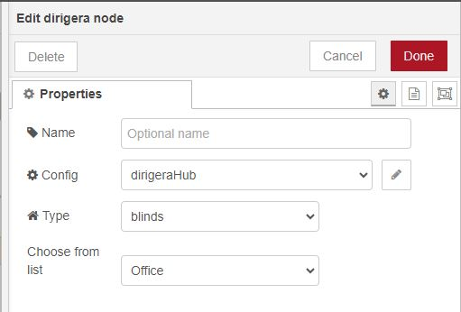
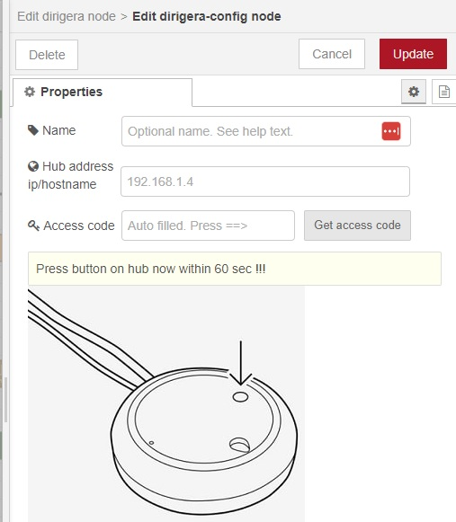

# node-red-contrib-dirigera

A Node-Red Node for controlling Ikea Dirigera hub

*This node is heavily inspired by the Tradfri alternative `node-red-contrib-ikea-home-smart`. For reference Tradfri is the first generation homesmart Ikea controller. Dirigera is the second.*

During setup of config you will be guided on how to get an access code. This does require physical access to the hub. For an easy start import the example.

**How to import:**
Menu top right -> Import -> Examples -> node-red-contrib-dirigera -> basic

 The node

 The config node